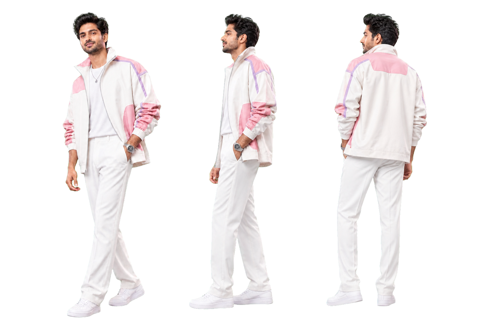
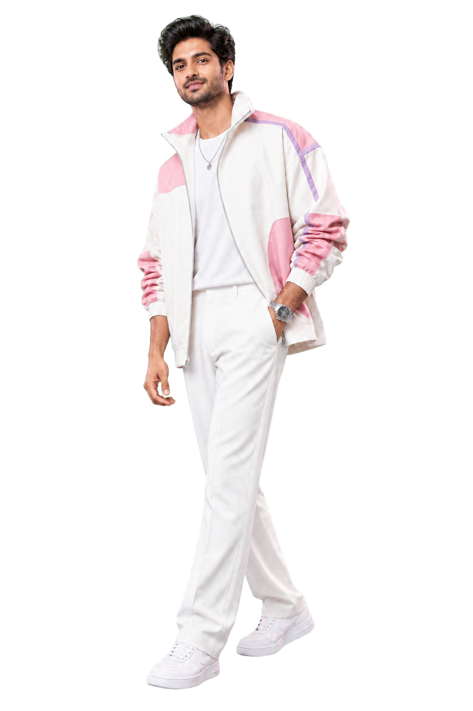
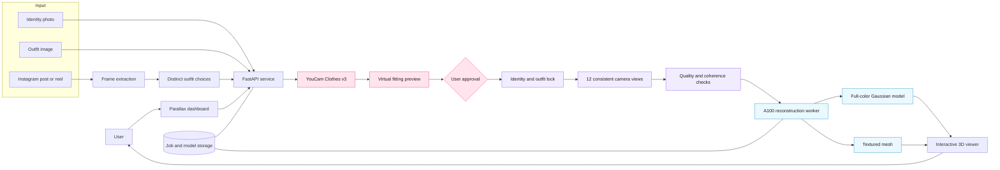
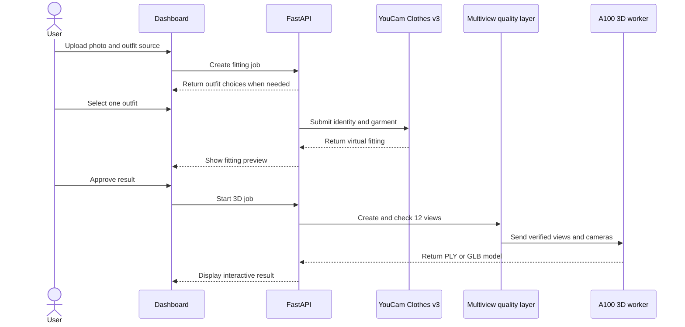

# Parallax

Turn an outfit reference into a virtual fitting and an interactive 3D look.

[](https://github.com/Harry-2005/YouCam-3D/actions/workflows/ci.yml)
[](LICENSE)
[](https://www.python.org/)
[](https://docs.perfectcorp.com/develop/introduction)
[](https://www.nvidia.com/en-us/data-center/a100/)
[](https://docs.nerf.studio/)

[Open the live product](https://parallax.34.143.145.140.nip.io)

## Description

Parallax is a virtual fitting and 3D fashion platform. A user uploads a clear photo of themselves and provides an outfit image or a public Instagram post. Parallax identifies the available clothes, lets the user choose one look, and uses the YouCam Clothes API to create a virtual try-on.

After the user approves the fitting, Parallax creates 12 consistent views of the same person and outfit. Those views are checked for identity, pose, clothing, color, and camera order before GPU reconstruction begins. The final result is an interactive, full-color 3D look that can be rotated, inspected, relit when supported, and downloaded from the dashboard.



## Impact

Online clothing decisions are usually based on product photos or a single flat preview. That makes it difficult to understand how a complete outfit may look on a specific person from different directions.

Parallax addresses this problem by connecting virtual fitting with 3D review:

- Shoppers can compare an outfit with their own appearance before making a decision.
- Social media inspiration can become a selectable fitting instead of remaining a screenshot or saved post.
- Multiple outfits found in one reel can be separated and shown as clear choices.
- Designers and retailers can present a fitted look from every direction without arranging a new photo shoot for each view.
- A consistent 3D result gives users more information than a single generated image.

## How we integrated the YouCam API

YouCam Clothes v3 is the fitting layer at the center of the workflow.

1. The user uploads a front-facing identity photo.
2. The user uploads an outfit image or pastes a public Instagram post or reel.
3. For social media input, Parallax extracts useful frames and groups distinct outfits.
4. The user selects the exact outfit they want to try.
5. The backend sends the protected identity image and selected garment image to YouCam Clothes v3.
6. Parallax polls the YouCam task and returns the completed fitting to the dashboard.
7. The user reviews the result before any 3D processing starts.
8. Once approved, the fitting becomes the locked reference for the 12-view and reconstruction pipeline.

YouCam credentials remain on the server. They are never sent to the browser or stored in frontend code.

## What we used

| Area | Technology | Purpose |
| --- | --- | --- |
| Virtual fitting | YouCam Clothes v3 | Applies the selected clothing to the user's photo |
| Backend | Python, FastAPI, Pydantic, Uvicorn | Handles uploads, jobs, polling, validation, and artifacts |
| Social media intake | yt-dlp, gallery-dl, FFmpeg | Reads public posts and selects useful clothing frames |
| Multiview pipeline | Controlled view synthesis and consistency checks | Creates a fixed 12-view orbit while protecting identity and clothing |
| 3D reconstruction | Nerfstudio Splatfacto | Builds a face-preserving, full-color Gaussian model |
| Mesh reconstruction | Hunyuan3D multiview | Builds a textured mesh that supports directional lighting |
| GPU runtime | NVIDIA A100, CUDA, PyTorch | Accelerates reconstruction and texture processing |
| 3D viewer | Three.js, SparkJS | Displays GLB, PLY, and Gaussian results in the browser |
| Deployment | Docker, systemd, Caddy | Runs isolated workers and serves the public HTTPS application |

## Example

A user finds an Instagram reel containing three outfits. They upload one front-facing photo and paste the reel URL into Parallax.

Parallax extracts the clearest clothing frames and presents the three outfits as separate options. The user selects a pink and white jacket. YouCam Clothes v3 fits that jacket to the user's photo, and the dashboard shows the result for approval.

After approval, Parallax keeps the same face, pose, jacket construction, colors, and accessories while creating 12 camera views at 30 degree intervals. The quality layer checks the views, and the A100 worker reconstructs them into a full-color 3D result. The user can rotate the model, inspect the outfit from the back and sides, adjust lighting on a mesh result, and download the final artifact.



## System architecture



### Request flow



## Pipeline rules

The 3D stage uses explicit rules because a set of attractive images is not automatically a valid reconstruction dataset.

- The approved YouCam fitting is the canonical identity and clothing reference.
- The camera follows a fixed orbit with known azimuth and elevation values.
- Identity, pose, garment structure, color, and accessories are compared across views.
- Repair passes correct major drift without rejecting small visual differences.
- Foreground masks prevent the studio background from becoming part of the model.
- Known camera transforms remove the need to estimate synthetic camera positions.

## Run the project

### Requirements

- Ubuntu 22.04 or newer
- Python 3.10 or newer
- Docker Engine and NVIDIA Container Toolkit
- CUDA-capable GPU, with NVIDIA A100 recommended
- YouCam Clothes v3 API credentials
- A configured multiview processing service
- A DNS name or reverse proxy for HTTPS

### Install

```bash
git clone https://github.com/Harry-2005/YouCam-3D.git
cd YouCam-3D

sudo install -d -m 0755 /tmp/nerfstudio-deploy
sudo cp -a deploy/. /tmp/nerfstudio-deploy/
sudo cp -a frontend /tmp/nerfstudio-deploy/frontend

sudo bash deploy/bootstrap.sh
sudo bash deploy/install.sh
```

Install the YouCam credential file on the server and restart the API:

```bash
sudo install -m 0600 /secure/path/youcam-creds.txt \
  /opt/nerfstudio-api/.youcam-api-key
sudo systemctl restart nerfstudio-api caddy
```

Verify the deployment:

```bash
curl https://your-domain.example/health
sudo systemctl is-active nerfstudio-api caddy docker
nvidia-smi
```

See [deploy/README.md](deploy/README.md) for the full host layout and deployment procedure.

## API example

Create a YouCam fitting job:

```bash
curl -X POST "$BASE_URL/v1/style-jobs" \
  -F "identity_image=@person.jpg" \
  -F "garment_image=@outfit.jpg" \
  -F "garment_category=auto"
```

Poll `GET /v1/style-jobs/{style_id}` and review the returned fitting. Approve it to start the 3D pipeline:

```bash
curl -X POST "$BASE_URL/v1/style-jobs/$STYLE_ID/approve" \
  -F "method=splatfacto" \
  -F "iterations=10000"
```

Read the pipeline status and download the completed model:

```bash
curl "$BASE_URL/v1/pipelines/$PIPELINE_ID"
curl -L -o model.zip "$BASE_URL/v1/pipelines/$PIPELINE_ID/model"
```

## Repository structure

```text
.
|-- deploy/
|   |-- app.py
|   |-- hunyuan_generate.py
|   |-- clean_textured_mesh.py
|   |-- bootstrap.sh
|   |-- install.sh
|   `-- nerfstudio-api.service
|-- frontend/
|   |-- index.html
|   |-- studio.html
|   |-- styles.css
|   `-- app.js
|-- docs/assets/
|   |-- parallax-wordmark.svg
|   |-- hero-subject.png
|   `-- orbit-views.png
`-- .github/workflows/ci.yml
```

## Security

- YouCam credentials stay on the server.
- Credential files, generated models, browser profiles, and job archives are ignored by Git.
- Upload validation limits file size and accepted media types.
- Archive extraction rejects path traversal and symbolic links.
- The service runs as a restricted, non-login system user.

Please report vulnerabilities privately as described in [SECURITY.md](SECURITY.md).

## Contributing

Issues and pull requests are welcome. Before opening a pull request, run:

```bash
python -m py_compile deploy/app.py deploy/hunyuan_generate.py deploy/clean_textured_mesh.py
node --check frontend/app.js
git diff --check
```

See [CONTRIBUTING.md](CONTRIBUTING.md) for contribution guidelines.

## License

Released under the [MIT License](LICENSE).
