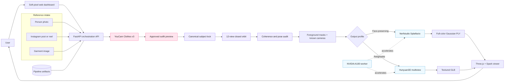
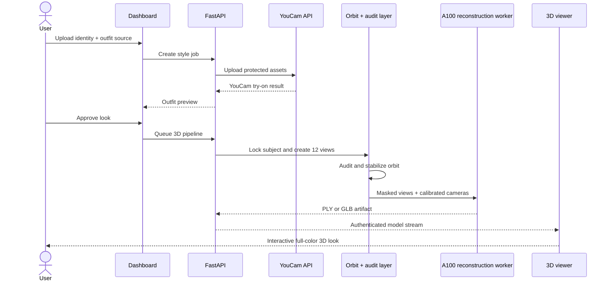

<div align="center">

# YouCam 3D

### Turn one outfit reference into a coherent, full-color 3D look.

[](https://github.com/Harry-2005/YouCam-3D/actions/workflows/ci.yml)
[](LICENSE)
[](https://www.python.org/)
[](https://fastapi.tiangolo.com/)
[](https://docs.perfectcorp.com/develop/introduction)
[](https://www.nvidia.com/en-us/data-center/a100/)
[](https://docs.nerf.studio/)

<br />


<br />

**YouCam 3D** is an image-first fitting room and GPU reconstruction service. A user uploads a person photo, supplies an outfit image or public Instagram URL, approves a YouCam virtual try-on, and receives a coherent twelve-view capture plus an interactive 3D result.

[Architecture](#system-architecture) · [Quick start](#quick-start) · [API](#api-workflow) · [Configuration](#configuration-flags) · [Contributing](#contributing)

</div>

---

## What it does

| Stage | Result |
| --- | --- |
| **Outfit understanding** | Extracts a useful garment frame from an image, post, or reel. |
| **YouCam virtual try-on** | Applies the selected outfit while retaining the user’s identity. |
| **Subject locking** | Freezes identity, pose, garment construction, colors, and accessories. |
| **Coherent orbit** | Builds twelve calibrated views at 30° azimuth intervals. |
| **Quality layer** | Audits identity, camera progression, pose drift, and reconstruction fitness. |
| **GPU reconstruction** | Produces either a face-preserving Gaussian model or a relightable textured mesh. |
| **Web viewer** | Displays the result with orbit controls, downloads, history, and mesh lighting. |

> [!IMPORTANT]
> **Provider clarity:** all public fashion-image generation and virtual try-on calls in the product experience are sent to **YouCam Clothes v3 APIs**. The closed-orbit stage is an internal reconstruction subsystem, not a user-selectable image-generation API.

## Why this pipeline

Generating twelve attractive images is easy. Generating twelve images that describe the **same rigid subject** is the actual reconstruction problem. YouCam 3D treats camera consistency as a first-class system concern:

- the front image becomes the canonical identity and pose contract;
- the rear anchor is generated with strict visibility rules;
- every view receives an explicit azimuth and fixed elevation;
- a semantic verifier checks identity, geometry, pose, and camera order;
- repair passes correct head or body drift without blocking minor cosmetic differences;
- synthetic views bypass COLMAP and use known camera transforms;
- foreground masks prevent the studio backdrop from becoming geometry.

<table>
  <tr>
    <td width="58%" valign="top">
      <h3>Two reconstruction profiles</h3>
      <p><strong>Face-preserving 3D</strong> uses Nerfstudio Splatfacto and is the default for people, hair, glasses, and facial detail.</p>
      <p><strong>Relightable mesh</strong> uses Hunyuan3D multiview geometry, a denser high-resolution surface, and 2K texture baking. It supports the dashboard’s directional lighting dome.</p>
      <p>The same verified twelve-view capture can be retrained without repeating outfit transfer or orbit generation.</p>
    </td>
    <td width="42%" align="center">
      
    </td>
  </tr>
</table>

## System architecture



### Request lifecycle



## Technology

| Layer | Technology | Purpose |
| --- | --- | --- |
| Fashion imaging | **YouCam Clothes v3** | Server-to-server virtual try-on and garment transfer |
| API | **FastAPI**, Pydantic, Uvicorn | Authenticated jobs, uploads, callbacks, polling, artifacts |
| Media ingestion | **yt-dlp**, gallery-dl, FFmpeg | Public post/reel extraction and frame selection |
| Orbit orchestration | Google Cloud generative media + Cloud Storage | Canonical subject locking and camera motion |
| Verification | Multimodal semantic audit | Identity, pose, geometry, and azimuth validation |
| Photometric 3D | **Nerfstudio Splatfacto** | Face-preserving full-color Gaussian reconstruction |
| Mesh 3D | **Hunyuan3D-2mv + Paint** | Relightable geometry and texture baking |
| GPU | **NVIDIA A100**, CUDA, PyTorch | High-throughput training and reconstruction |
| Viewer | **Three.js**, SparkJS | GLB, PLY, Gaussian rendering, orbit and lighting controls |
| Runtime | Docker, systemd, Caddy | Isolated GPU jobs and production service lifecycle |

## Quick start

### Prerequisites

- Ubuntu 22.04+ GPU host
- NVIDIA driver with a CUDA-capable GPU; A100 recommended
- Docker Engine and NVIDIA Container Toolkit
- Python 3.10+
- Google Cloud service account attached to the host
- YouCam API credentials with Clothes v3 access
- A DNS name for TLS, or a trusted reverse proxy

### 1. Clone

```bash
git clone https://github.com/Harry-2005/YouCam-3D.git
cd YouCam-3D
```

### 2. Stage the deployment bundle

The install script reads from `/tmp/nerfstudio-deploy` and writes the runtime to `/opt/nerfstudio-api`.

```bash
sudo install -d -m 0755 /tmp/nerfstudio-deploy
sudo cp -a deploy/. /tmp/nerfstudio-deploy/
sudo cp -a frontend /tmp/nerfstudio-deploy/frontend

sudo bash deploy/bootstrap.sh
sudo bash deploy/install.sh
```

### 3. Configure credentials and storage

```bash
sudoedit /opt/nerfstudio-api/.env
sudo install -m 0600 /path/to/youcam-creds.txt \
  /opt/nerfstudio-api/.youcam-api-key
sudo systemctl restart nerfstudio-api
```

At minimum, review these values:

```dotenv
API_KEY=generate-a-long-random-value
DATA_ROOT=/var/lib/nerfstudio-api/jobs
CACHE_ROOT=/var/lib/nerfstudio-api/cache
PIPELINE_ROOT=/var/lib/nerfstudio-api/pipelines
STYLE_ROOT=/var/lib/nerfstudio-api/style-jobs
YOUCAM_API_KEY_FILE=/opt/nerfstudio-api/.youcam-api-key
NERFSTUDIO_IMAGE=ghcr.io/nerfstudio-project/nerfstudio:latest
```

Edit `deploy/Caddyfile` for your hostname before installation. The API listens on `127.0.0.1:8000`; Caddy owns the public TLS endpoint.

### 4. Verify

```bash
curl https://your-domain.example/health
sudo systemctl status nerfstudio-api caddy
nvidia-smi
```

Open `https://your-domain.example/dashboard/`, enter the generated bearer token, and create a look.

## API workflow

All non-health routes require `Authorization: Bearer <token>`.

### Create a YouCam outfit preview

```bash
curl -X POST "$BASE_URL/v1/style-jobs" \
  -H "Authorization: Bearer $API_TOKEN" \
  -F "identity_image=@person.jpg" \
  -F "garment_image=@outfit.jpg" \
  -F "garment_category=auto"
```

Poll `GET /v1/style-jobs/{style_id}`. When it is complete, review `/garment` and `/result`, then approve it:

```bash
curl -X POST "$BASE_URL/v1/style-jobs/$STYLE_ID/approve" \
  -H "Authorization: Bearer $API_TOKEN" \
  -F "method=splatfacto" \
  -F "iterations=10000"
```

### Follow and download the 3D job

```bash
curl -H "Authorization: Bearer $API_TOKEN" \
  "$BASE_URL/v1/pipelines/$PIPELINE_ID"

curl -L -H "Authorization: Bearer $API_TOKEN" \
  -o model.zip "$BASE_URL/v1/pipelines/$PIPELINE_ID/model"
```

Use `POST /v1/pipelines/{id}/retrain` with `method=splatfacto`, `nerfacto`, or `nerfacto-big` to reuse the existing views without repeating the image pipeline.

## Configuration flags

| Variable | Default | Description |
| --- | ---: | --- |
| `PIPELINE_VIEW_COUNT` | `12` | Fixed closed-orbit frame count |
| `PIPELINE_ELEVATION` | `10` | Camera elevation in degrees |
| `PIPELINE_COHERENCE_THRESHOLD` | `0.80` | Preferred semantic quality target |
| `PIPELINE_MIN_USABLE_COHERENCE` | `0.40` | Soft floor for non-critical inconsistencies |
| `PIPELINE_MIN_IDENTITY_SCORE` | `0.75` | Hard floor for identity preservation |
| `PIPELINE_STABILIZATION_PASSES` | `2` | Maximum pose-repair passes |
| `PIPELINE_STABILIZATION_WORKERS` | `4` | Concurrent repaired-view workers |
| `YOUCAM_TASK_TIMEOUT` | `420` | YouCam polling timeout in seconds |
| `NERFSTUDIO_IMAGE` | `ghcr.io/nerfstudio-project/nerfstudio:latest` | GPU worker container |

### Reconstruction profiles

| UI option | API method | Best for | Artifact | Relighting |
| --- | --- | --- | --- | --- |
| Face-preserving 3D | `splatfacto` | People, faces, hair, eyewear | Gaussian `.ply` | No |
| Relightable mesh | `hunyuan3d` | Portable surface geometry | Textured `.glb` | Yes |
| NeRF mesh | `nerfacto` | Experimental radiance-field export | PLY + mesh | Baked |
| Detailed NeRF | `nerfacto-big` | Higher-capacity scene reconstruction | PLY + mesh | Baked |

## Repository layout

```text
.
├── deploy/
│   ├── app.py                    # FastAPI service and pipeline orchestration
│   ├── hunyuan_generate.py       # Multiview mesh + texture worker
│   ├── clean_textured_mesh.py    # Component and floor cleanup
│   ├── bootstrap.sh              # Docker/NVIDIA host bootstrap
│   ├── install.sh                # Service installation
│   └── nerfstudio-api.service    # Hardened systemd unit
├── frontend/
│   ├── index.html                # Dashboard structure
│   ├── styles.css                # Soft-pixel design system
│   └── app.js                    # Jobs, viewer, history, lighting
├── docs/assets/                  # README artwork
└── .github/workflows/ci.yml      # Syntax and repository checks
```

## Security

- YouCam credentials and the application bearer token stay server-side.
- Credential files, generated models, browser profiles, and job archives are ignored by Git.
- Uploads are size- and MIME-limited; ZIP extraction rejects traversal and symlinks.
- The systemd service uses a non-login user, `NoNewPrivileges`, `PrivateTmp`, and a restricted writable path.
- Never expose `/opt/nerfstudio-api/.env`, `.youcam-api-key`, or a service-account JSON file.

Please report vulnerabilities privately as described in [SECURITY.md](SECURITY.md).

## Contributing

Issues and pull requests are welcome. Run the lightweight checks before opening a PR:

```bash
python -m py_compile deploy/*.py
node --check frontend/app.js
git diff --check
```

See [CONTRIBUTING.md](CONTRIBUTING.md) for branch, commit, and review guidance.

## License

Released under the [MIT License](LICENSE).

---

<div align="center">
  Built for coherent fashion imaging, practical GPU reconstruction, and a delightful 3D review experience.
</div>
